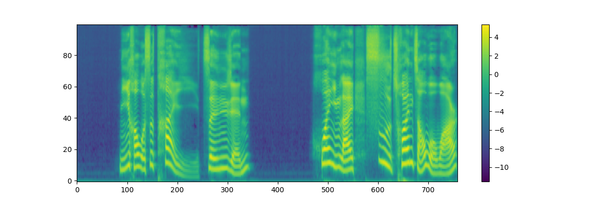
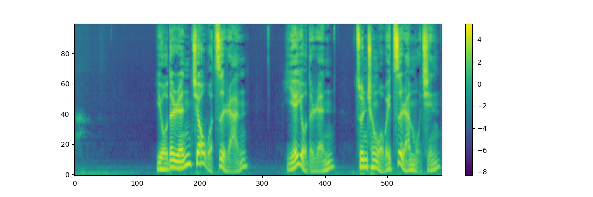

# F5-TTS-ComfyUI
a custom node for [F5-TTS](https://github.com/SWivid/F5-TTS),you can find [workflow here](./doc/base_workflow.json)

## Example

| gen_text | ref_audio | out_audio | audio_img |
| -- | -- | -- | -- |
|`你好，我是太乙真人！欢迎来四川找我玩`| <video src="https://github.com/user-attachments/assets/6758239e-9215-4301-ba06-ac9dad06c306" /> | <video src="https://github.com/user-attachments/assets/2f08ad54-0728-4542-84d3-6e8588b6ef3d" /> |  |
|`有的人叫我自然，也有的人尊称我为自然母亲`|  <video src="https://github.com/user-attachments/assets/89fde537-abba-4959-9e8f-03230d76014a" /> | <video src="https://github.com/user-attachments/assets/c4058295-1db1-4009-af7d-4c84339eae59" /> | 
